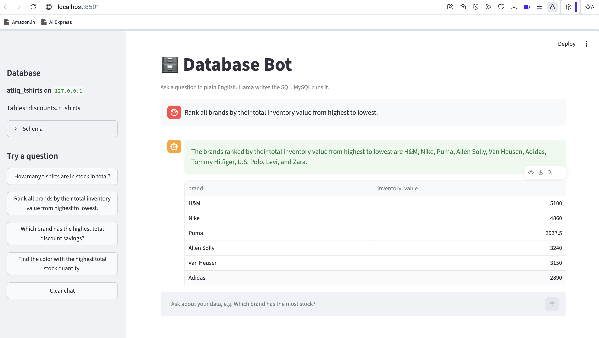

# Text-to-SQL with Ollama and MySQL

Ask a question in plain English and get an answer from a MySQL database. A local LLM (Llama 3.2 running in Ollama) writes the SQL, Python runs it, and the model turns the result into a short sentence. Everything runs on your own machine, with no API keys and no cost.

## How it works

1. Connect to MySQL and read the table schema.
2. Send the schema and your question to the model.
3. The model returns a SQL query.
4. The script checks that it is a read-only `SELECT` query, then runs it.
5. The model explains the result in one sentence.

```
Question -> Llama 3.2 -> SQL -> MySQL -> Result -> Llama 3.2 -> Answer
```

## Requirements

- Python 3.10 or newer
- [MySQL](https://dev.mysql.com/downloads/) running locally
- [Ollama](https://ollama.com/) with the `llama3.2` model

## Setup

**1. Clone the repository and install dependencies**

```bash
git clone https://github.com/Sinan-ck/Dtabase_bot.git
cd Dtabase_bot
pip install -r requirements.txt
```

**2. Pull the model**

```bash
ollama pull llama3.2
```

**3. Create the sample database**

```bash
mysql -u root -p < schema.sql
```

**4. Add your settings**

```bash
cp .env.example .env
```

Open `.env` and set `DB_PASSWORD` to your MySQL password. The `.env` file is ignored by git, so your password is not uploaded.

## Run

Make sure MySQL and Ollama are running, then:

```bash
python app.py
```

To ask something else, edit the `question` line in `app.py`.

## Example

Question: *Rank all brands by their total inventory value from highest to lowest.*

The model should generate SQL along these lines:

```sql
SELECT brand, SUM(price * stock_quantity) AS total_value
FROM t_shirts
GROUP BY brand
ORDER BY total_value DESC;
```

With the sample data, the expected ranking is Levi (4136), Van Huesen (1050), then Adidas (782). Exact wording and SQL can vary between runs.

## Project files

| File | Purpose |
|------|---------|
| `app.py` | Main script |
| `schema.sql` | Creates the sample database, tables and data |
| `requirements.txt` | Python dependencies |
| `.env.example` | Template for your database settings |

## Limitations

- `llama3.2` is a small model, so it can get complex queries wrong (joins, multi-step logic). Always check the printed `SQL:` line.
- The script only runs queries that start with `SELECT` or `WITH`, but this is a basic guard, not full protection. For anything beyond a local demo, use a read-only MySQL user.
- The model only knows the tables in the database named in `DB_NAME`.

## Troubleshooting

| Problem | Fix |
|---------|-----|
| `Connection refused` | MySQL is not running. Start it with `brew services start mysql`. |
| `Access denied for user 'root'` | The password in `.env` is wrong. |
| `Unknown database` | Run `schema.sql` first. |
| Model answers in words instead of SQL | Check that `DB_NAME` points to the database with the tables you are asking about. |
| `cryptography` package error | Run `pip install cryptography`. |

## Built with

[LangChain](https://www.langchain.com/) - [Ollama](https://ollama.com/) - [SQLAlchemy](https://www.sqlalchemy.org/) - [PyMySQL](https://pymysql.readthedocs.io/)

## Streamlit app

A chat interface with few-shot example retrieval (FAISS) is included.

```bash
pip install -r requirements.txt
streamlit run streamlit_app.py
```

Open http://localhost:8501 and ask a question in plain English. The app shows the answer, a result table, the generated SQL, and the similar examples it used.

## Screenshot


